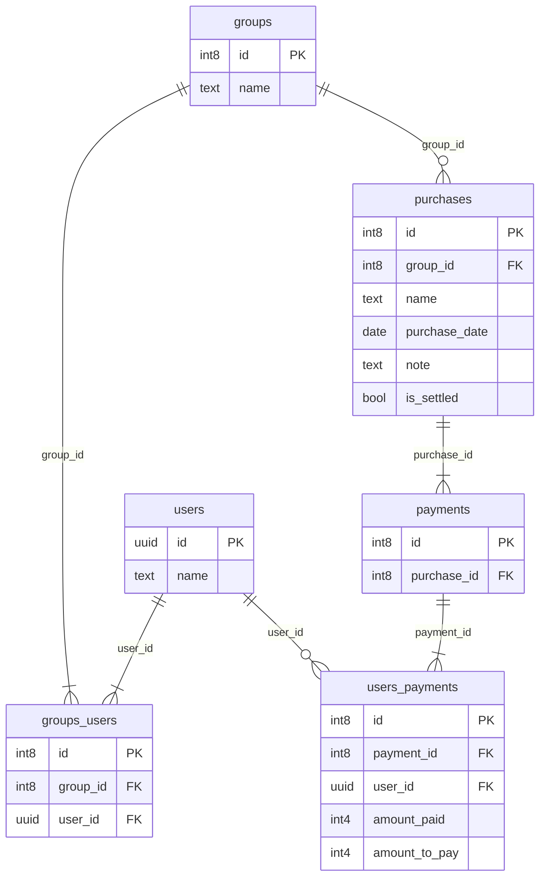

# ER 図

```mermaid
erDiagram
  groups ||--|{ groups_users: "group_id"
  users ||--|{ groups_users: "user_id"
  groups ||--o{ purchases: "group_id"
  purchases ||--|{ payments: "purchase_id"
  users ||--o{ users_payments: "user_id"
  payments ||--|{ users_payments: "payment_id"

  groups {
    int8 id PK
    text name
  }

  groups_users {
    int8 id PK
    int8 group_id FK
    uuid user_id FK
  }

  users {
    uuid id PK
    text name
  }

  purchases {
    int8 id PK
    int8 group_id FK
    text name
    date purchase_date
    text note
    bool is_settled
  }

  payments {
    int8 id PK
    int8 purchase_id FK
  }

  users_payments {
    int8 id PK
    int8 payment_id FK
    uuid user_id FK
    int4 amount_paid
    int4 amount_to_pay
  }
```
