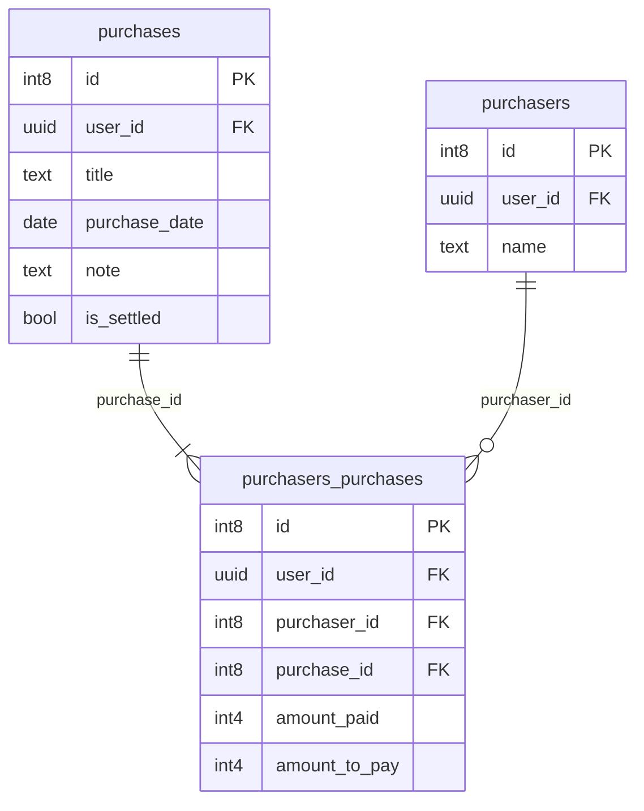

# ER 図

```mermaid
erDiagram
  purchases ||--|{ purchasers_purchases: "purchase_id"
  purchasers ||--o{ purchasers_purchases: "purchaser_id"

  purchases {
    int8 id PK
    uuid user_id FK
    text title
    date purchase_date
    text note
    bool is_settled
  }

  purchasers {
    int8 id PK
    uuid user_id FK
    text name
  }

  purchasers_purchases {
    int8 id PK
    uuid user_id FK
    int8 purchaser_id FK
    int8 purchase_id FK
    int4 amount_paid
    int4 amount_to_pay
  }
```
